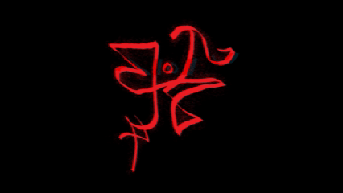

# 📜 cunfyooz: Demented Mind

## A Grimoire of Shifting Glyphs and Metamorphic Incantations

Lo, within these vellum-bound leaves lies **cunfyooz** \
an engine wrought in the iron tongue of C \
a vessel of ever-changing glyphs and deceitful transformations

It is no mere tool of mortals \
but a metamorphic daemon that bends the flesh of binaries \
reshaping their quintessence whilst preserving their dread vitality

To study this tome is to risk madness \
For within, each glyph is unstable, each incantation mutable, and each revelation forever cloaked in shifting shadows

---

 

**cunfyooz** - a sapient sigil - shifting and transforming in accordance with its metamorphic nature

---

## 📖 On the Nature of Metamorphosis

The **Metamorphic Code** is the tongue of the Unseen:

- A language that alters its form with each utterance, never twice the same
- A mirror that shows false reflections, its face ever-shifting yet its truth preserved
- A cloak against the gaze of hunters and wardens who seek to bind it

The key traits of such code are:
- **Equivalence of Spirit**: The work yet performs its destined purpose
- **Diversity of Flesh**: Each incarnation wears a new skin
- **Self-Alteration**: The daemon reshapes not only others, but itself
- **Obfuscation Against the Eye**: The wards of analysis falter before its writhing form

---

## 📚 Use and Summonings

The conjurer may invoke cunfyooz to:

- Frustrate the prying eyes of rival sorcerers
- Impede the scrying arts of static and dynamic analysis
- Shroud code in protective veils
- Study the ways of shapeshifting hexcraft
- Teach acolytes the lore of obfuscation

---

## ⚔ Supported Artefacts

The daemon feasts upon **PE binaries** \
which bear the sigil of MZ and the PE Seal \
consuming their essence to rebirth them anew

---

## ✦ Forbidden Arts and Blackened Features

Within the daemon's arsenal lie these cursed powers:

- **True Random Metamorphosis**: Each invocation yields an unseen pattern, guided by the shifting tides of Time
- **Sophisticated Glyph Insertion**: Null runes (NOP) woven into safe places, invisible yet potent
- **Functional Substitution**: One rune traded for another of equal power, yet alien form
- **Warped Flow of Control**: Paths twisted by opaque predicates and false forks
- **Expansion of Null Runes**: Beyond the simple `0x90`, cunfyooz speaks in the tongues of `xchg`, `lea`, `test`, `add`, and `sub`
- **Instruction Reordering**: Glyphs reshuffled, yet bound by dependency wards
- **Register Shuffling**: The sacred vessels of state are shuffled like bones cast in prophecy
- **Stack Frame Distortion**: Illusions woven into the ritual of function calls
- **Virtualization**: Flesh dissolved into bytecode, spirit bound to a daemon-machine
- **Anti-Scrying Wards**:
  - Detection of debuggers and watchers
  - Timed incantations to sense false realities
  - Warding against the claws of reverse-engineering tools

---

## 🜍 The Summoning Rite

To breathe life into the daemon **cunfyooz**, thou must gather sacred relics and perform the rite in proper sequence

### ✦ Sacred Relics Required

- **The Compiler of Iron (GCC)** — the hammer that forges glyphs into steel
- **Capstone, the Disassembler** — an ancient relic that rends flesh into glyphs, revealing the bones of code
- **Keystone, the Assembler** — the black forge that reforges glyphs into living flesh
- **GNU Make** — the ritual overseer, conductor of chants and invocations

Without these, the daemon lies dormant, a pile of lifeless runes and bloodied flesh

### ✦ Invocation of Relics

**First, summon the Capstone Engine from the void:**

```bash
git clone https://github.com/aquynh/capstone.git
cd capstone
make
sudo make install
```

**Then, awaken the Keystone Forge:**

```bash
git clone https://github.com/keystone-engine/keystone.git
cd keystone
mkdir build && cd build
cmake -DCMAKE_BUILD_TYPE=Release -DBUILD_SHARED_LIBS=ON ..
make
sudo make install
```

**Finally, speak the Great Command to bind the daemon itself:**

```bash
make
```

At this utterance, the daemon stirs
Its name is etched in your `/bin/`, waiting to be called

### ✦ Summoning the Daemon

To invoke the beast upon an offering:

```bash
./bin/cunfyooz <sigil_of_PE_binary>
```

Where `<sigil_of_PE_binary>` is the vessel to be sacrificed — a PE file bearing the MZ mark
The daemon shall consume this offering and disgorge a transfigured clone, cloaked in veils of obfuscation \
It shall bear a dark mark upon its name:

```bash
cunfyoozed_<original_name>.exe
```

### ✦ Ritual Parameters

At present, the daemon heeds only a single chant:

- `<input_pe_binary>` — the path to the vessel to be warped

But beware — if the scroll `config.json` lies within the chamber, the daemon will heed its parameters above all else, obeying its thresholds of transformation as if they were binding glyphs carved into stone

🔥 **Thus is the Summoning Rite of cunfyooz: Demented Mind** 
Perform it well, and thou shalt command a daemon of metamorphosis, reshaping binaries into endless grotesque forms

---

## 🩸 Anatomy of the Daemon (Architecture)

The daemon cunfyooz is no simple construct of mortal craft — it is a shifting abomination, composed of organs both natural and unnatural \
Each part conspires in the ritual of transformation, keeping the beast alive and endlessly mutable

### ⚔ The Mouth of the Daemon — PE Parser

Here lies the daemon's gaping maw, lined with rune-carved teeth \
It consumes Portable Executable vessels, gnawing on their headers, tearing apart section tables, and spitting forth the `.text` flesh for reshaping

### 👁 The Eyes of Disassembly — Disassembler

Burning with the sight of **Capstone**, these eyes pierce raw bytes and behold their hidden glyphs \
They see operands, addresses, and structures, mapping the bones of the victim so no glyph is misplaced when the flesh is reknit

### 🩸 The Claws of Mutation — Transformer

With talons tipped in algorithmic venom, these hands tear instructions apart and rebuild them into twisted yet living forms \
Through NOP runes, substitutions, register shuffling, control-flow warping, and more, the daemon leaves behind only grotesque shapes, each still functional, each unrecognizable

### 🌑 The Shadow — Virtualization Engine

Not of flesh, but of phantasm. \
This shadow engulfs native code, dissolving it into bytecode whispers, which the daemon's phantom-machine interprets in secrecy \
A cloak within a cloak, a labyrinth within a labyrinth

### 🔨 The Forge of Flesh — Assembler

Powered by **Keystone's** black anvil, this forge hammers the reshaped glyphs back into executable flesh \
Here the daemon is reborn, ready to walk again among mortals — changed, yet unchanged

### 🜏 The Heart of Orchestration — Main Controller

At the daemon's core, a black heart beats, pumping ichor between organs \
It commands transformations in sequence, balances resource offerings, and ensures no piece of the ritual strays into madness

### 🧿 The Nerves — Control Flow Analysis Engine

A web of sinews mapping paths of motion \
It charts basic blocks, entry points, and forbidden branches, ensuring that the daemon's movements remain deadly but precise

### 💀 The Ichor — Data Flow Analysis Engine

A river of dependencies flows through the daemon, connecting registers and memory alike \
These currents preserve the integrity of spells while the flesh mutates — without this flow, chaos would reign

### 🕷 The Skins of Wards — Anti-Analysis Module

Upon the daemon's hide are etched runes that confound the hunter's gaze \
Timing wards, debugger detection sigils, and virtualization omens repel those who would dissect it

### 📜 The Tongue of Configurations — JSON Parser

The daemon's tongue tastes the scrolls of `config.json` \
Through this tongue, the summoner's will is made flesh, dictating intensity, probability, and the exact nature of the daemon's transformations

---

## 🔮 The Necromantic Rite of Transformation (Pipeline)

To bend a binary into new, twisted flesh, the summoner must enact the **10 Circumscriptions** \
Each circle binds the daemon further, reshaping the vessel without unmaking its soul

### ⚜ Circle I — The Invocation of Configuration

The scroll of `config.json` is unfurled upon the altar \
Its runes dictate the daemon's appetite — probabilities, intensities, permissions \
Without it, the daemon defaults to its ancient instincts

### ⚜ Circle II — The Carving of Null Runes (NOP Insertion)

Ashen glyphs of silence (NOP) are scattered into the code's veins \
Placed carefully, never after branches or leaps, they confuse watchers without corrupting the vessel's spirit

### ⚜ Circle III — The Substitution of Glyphs (Instruction Substitution)

Here the summoner trades one rune for another of equal power \
`LEA` becomes `MOV`, `TEST` becomes `CMP` \
The spell is the same — the shape is alien

### ⚜ Circle IV — The Casting of Bones (Register Shuffling)

The daemon rattles its sacred vessels of state \
Registers are shuffled like knucklebones cast on a tombstone, yet destiny is preserved \
Critical vessels (RSP, RBP) remain untouched, for their breaking would unravel the ritual

### ⚜ Circle V — The Insertion of Falsehoods (Enhanced NOPs)

The silence deepens into mimicked actions: `xchg rax, rax`, `lea rax, [rax + 0]`, `test rax, rax` \
Movements that move nothing, shadows that cast no light

### ⚜ Circle VI — The Twisting of Paths (Control Flow Obfuscation)

A labyrinth of false corridors is woven into the flow \
Opaque predicates, unreachable blocks, phantom branches \
The traveler still reaches the chamber, but wanders needlessly in despair

### ⚜ Circle VII — The Hands of Phantoms (Stack Frame Obfuscation)

Spectral push and pop pairs caress the stack, preserving vessels but confusing the eye \
The function's structure becomes a hall of mirrors

### ⚜ Circle VIII — The Reordering of Glyphs (Instruction Reordering)

The daemon reshuffles glyphs within basic blocks, guided by dependency wards \
A verse of code is sung in a different order, yet the hymn remains the same

### ⚜ Circle IX — The Raising of Wards (Anti-Analysis Techniques)

The daemon etches wards into its hide:

- Timers that betray virtualization
- Marks that sense debugger's claws
- Omens that sniff out reverse-engineering tools

Those who attempt to pierce it are met with smoke and falsehood.

### ⚜ Circle X — The Shadow Cloak (Virtualization)

**The Ashen Veil** \
The daemon dissolves the vessel into bytecode binding it within a phantom machine \
Here the code is no longer flesh but shadow, interpreted by a daemon-born virtual host

**Thus concludes the Rite of Ten Circles** \
When the summoner completes it, the vessel is reborn — function preserved, form unrecognizable \
A twin birthed in madness, a child of metamorphosis

---

## 🩸 The Autopsy of Metamorphosis (How It Works)

When the daemon awakens to consume a binary \
it performs a ritual of seven blood rites \
each an essential phase of rebirth

### I. The Rending of Flesh (PE Parsing)

The daemon's maw opens, sinking its teeth into the Portable Executable vessel \
It seeks the `.text` section — the meat of instructions — ripping raw bytes from the husk while cradling headers and sigils (virtual addresses, section wards, metadata) \
Thus the body is laid bare for desecration

### II. The Opening of Eyes (Disassembly)

The daemon's burning Capstone eyes gaze into the stripped flesh \
It beholds not raw gore and gristle, but glyphs: operands, addressing modes, instruction metadata \
The corpse is mapped into structured incantations, glyphs awaiting corruption

### III. The Whispering of Oracles (Analysis)

Before corruption, the daemon consults its inner oracles:

- **Control Flow Seer** — divines the paths of execution, the branching forks, the forbidden alleys
- **Data Flow Oracle** — tracks vessels of state (registers, memory) through lifeblood and whispers how they depend upon each other
- **Dependency Graph** — woven like spider silk, mapping which glyphs may be safely shifted without breaking fate

The daemon knows the vessel's destiny, even as it prepares to warp it

### IV. The Mutation of Flesh (Transformation)

With its claws, the daemon rends the instructions. Each pass is another layer of mutation:

- Silent runes (NOPs) carved into the flesh
- Substituted incantations, mirrors of equals
- Shuffled vessels of state
- Phantom stack-hands woven into the spine
- False corridors drawn in its flow of control

Each cut preserves life, but ensures the vessel shall never look the same again

### V. The Wards of Binding (Validation)

The daemon checks its work against the original host \
Does the spawn still walk the same path? \
Does it return to the same omens? \
If not, the daemon re-weaves the flesh, ensuring loyalty to the master's command

### VI. The Forging of Flesh (Assembly)

The black Keystone forge ignites \
The reshaped glyphs are hammered into new executable flesh \
Runes are encoded into steel-bits once more, ready to be clothed in headers and metadata

### VII. The Resurrection (PE Reconstruction)

The daemon completes its work \
The reshaped `.text` is stitched back into a PE husk, headers restored, sigils preserved \
The new vessel awakens: the same spirit within, but draped in a new, grotesque skin \
It walks among mortals as if unchanged — yet every glyph in its flesh has been warped by metamorphosis

⚜️ **Thus ends the autopsy** 
The cycle of sacrifice, mutation, and resurrection is eternal \
each invocation births another warped spawnling, ever-shifting, ever-deceiving, forever scoffing

---

## 🕯 Incantatory Examples of Transformation

### ✦ NOP Insertion: The Ashes of Silence

**Original glyphs (unmarked flesh):**

```asm
mov rax, rbx
add rax, 5
```

**After silence-runes are carved:**

```asm
mov rax, rbx
nop                 ; the silent ash rune
add rax, 5
```

**When silence grows into echoes of falsehood:**

```asm
mov rax, rbx
xchg rax, rax       ; the ouroboros rune, self-consuming
add rax, 5
```

### ✦ Substitution of Incantations: The Mirror of Equals

**Original incantation:**

```asm
lea rax, [rbx]
```

**Reflected in the Mirror of Equals:**

```asm
mov rax, rbx        ; different form, same essence
```

**Another fragment:**

```asm
; Original invocation
test rax, rax
je label
```

```asm
; Mirror-image form
cmp rax, 0
je label
```

The glyphs shift, yet the spell is unchanged \
The daemon laughs at the watcher who cannot tell reflection from truth

### ✦ Shuffling of Registers: The Bones of Fate

**Before the casting of bones:**

```asm
mov rax, 1
mov rbx, 2
add rax, rbx
```

**After bones are cast upon the altar:**

```asm
mov rcx, 1          ; vessel reshaped
mov rdx, 2          ; vessel renamed
add rcx, rdx        ; the ritual preserved
; The daemon ensures the true result finds its destined vessel
```

### ✦ Control Flow Obfuscation: The Forking Path of Lies

**Straight road before corruption:**

```asm
cmp eax, ebx
jne skip
call function
skip:
```

**When the daemon twists the path into a labyrinth:**

```asm
cmp eax, ebx
je else_part        ; false branch conjured
jmp skip            ; the maze bends
else_part:
call function
skip:
```

Thus the traveler is lost, wandering false corridors before reaching the same chamber.

### ✦ Stack Frame Obfuscation: The Ghostly Hands

**Before the haunting:**

```asm
mov rax, 5
add rbx, rax
```

**After the phantoms lay their hands upon the stack:**

```asm
push rax            ; the ghost preserves the vessel
mov rax, 5
add rbx, rax
pop rax             ; the ghost restores what was taken
```

The ritual completes unchanged, but the phantom hands confuse the unwary scribe

⚜️ **Thus are the fragments of transformation** — whispers carved into assembly, talismans of deceit, each preserving the spirit while defiling the flesh

---


---

## 📜 The Scroll of Binding Runes (JSON Configuration Parser)

The daemon cunfyooz does not obey blindly — its rage and transformations may be channeled through a scroll of binding runes, known among mortals as `config.json`

Those who etch the proper glyphs into this scroll may command the daemon's intensity, its appetite, and its cruelty \
But beware: malformed runes may awaken the daemon's ire, leading to cryptic curses and broken vessels

### ✦ Nature of the Scroll

- **Lightweight yet potent** — carved by hand, untainted by dependencies
- **Flexible** — the summoner may decide which transformations to unleash, and how strong each should be
- **Error-bound** — malformed runes shall summon curses in the daemon's tongue
- **Fallback to defaults** — when the summoner errs, the daemon falls back upon its ancient instincts
- **Extensible** — new sigils may be carved as the daemon evolves

### ✦ The Shape of the Scroll

The scroll is written in the tongue of JSON, a language of rigid brackets and colons, simple yet unforgiving

```json
{
  "transformations": {
    "nop_insertion": {
      "enabled": true,
      "probability": 5
    },
    "instruction_substitution": {
      "enabled": true,
      "probability": 10
    },
    "register_shuffling": {
      "enabled": true,
      "probability": 8
    },
    "enhanced_nop_insertion": {
      "enabled": true,
      "probability": 3
    },
    "control_flow_obfuscation": {
      "enabled": true,
      "probability": 5
    },
    "stack_frame_obfuscation": {
      "enabled": true,
      "probability": 2
    },
    "instruction_reordering": {
      "enabled": true,
      "probability": 5
    },
    "anti_analysis_techniques": {
      "enabled": true,
      "probability": 15
    },
    "virtualization_engine": {
      "enabled": false,
      "probability": 10
    }
  },
  "output": {
    "verbose": true,
    "log_transformations": true
  },
  "security": {
    "validate_functionality": true,
    "preserve_original_behavior": true
  }
}
```

### ✦ The Runes of Power

Each rune carved into the scroll bears meaning:

- `enabled` — **true** awakens the transformation, **false** binds it in chains
- `probability` — the chance (measured in numbers, 1–100) that the daemon shall inscribe this change upon the vessel
- `output` — dictates whether the daemon speaks aloud its actions, or works silently in the shadows
- `security` — forces the daemon to check its spawn against the original, ensuring the twin remains loyal and functional

### ✦ The Tongue of the Parser

The daemon's tongue is split in twain:

- **Tokenizer** — divides the scroll into fragments, like bones cracked for marrow
- **Recursive Descent** — descends deeper into the scroll's nested glyphs, parsing arrays and objects like winding labyrinths

It is careful in memory, safe in types, and cruel in error recovery \
Should the summoner mis-carve a glyph, the daemon spits out a cursed error, naming the blasphemy

### ✦ Usage in the Ritual

To command the daemon thus, place a `config.json` scroll within the summoning chamber (working directory) \
If the daemon finds it, it will obey the scroll's binding glyphs \
If not, it reverts to its feral state, guided only by default instincts

🔥 **Thus is the Scroll of Binding Runes**, the key to tempering chaos with control \
To wield it is to place the daemon on a leash woven of symbols — never fully safe, but slightly less likely to devour its master

---

## 🧪 Ritual Experiments (Testing the Daemon)

To prove that the daemon answers your call, thou must first bind the vessel:

```bash
make
```

Then, offer it a test sacrifice, a vessel marked `test_pe.exe`:

```bash
./bin/cunfyooz test_pe.exe
```

From this ritual will arise a warped twin, named:

```bash
test_pe.exe_transformed
```

This newborn carries all the daemon's shifting mutations, yet still obeys its master \
The form may be twisted, but the soul remains bound to the same fate

**Thus is the experiment complete:** 
the daemon lives & the rite has succeeded

---

## 🧿 Exorcisms and Wards (Troubleshooting)

Even bound daemons grow unruly
Should calamity strike, heed these exorcisms:

- **Segmentation Faults**: 
+ The daemon once tore itself asunder with memory leaks
+ These wounds are sealed now by stable wards of allocation and deallocation
+ Should the daemon falter, look first to memory corruption — it is the whisper of old curses

- **Failed Creation of PE Vessels**: 
+ If the daemon devours more flesh than the vessel can hold, the PE writer now expands the husk, ensuring the soul may still reside within

- **Invalid or Cursed PE Files**: 
+ The daemon preserves sacred seals — AddressOfEntryPoint, ImageBase, Subsystem, and others
+ When these wards are kept intact, the vessel may walk among mortals unchallenged

- **"This App Cannot Run" Curse**: 
+ Such plagues once befell careless summoners
+ But the daemon now keeps the body whole, preventing this hex from arising

- **Metamorphic Consistency**: 
+ Each summoning is unique, bound to the shifting hands of Time
+ If thou findest two spawn alike, something is amiss

- **Excessive Growth of Flesh**: 
+ The daemon fattens its offspring with NOP runes and false limbs
+ Fear not — this grotesque swelling is an expected side effect of its power

🔥 **Thus are the exorcisms and ritual remedies** \
With them, the summoner bends the daemon back into obedience, ensuring that no invocation collapses into chaos uncontrolled

---

## ☠ Curses, Warnings, and Forbidden Invocations

Let it be writ in black flame: the daemon cunfyooz is no toy of mortals, but a vessel of shadowed power \
Those who wield it must heed these curses, lest they be undone

### 🜏 The Curse of Madness

Be warned: the daemon's transformations may be invisible to mortals, but not to _all_ who walk the Planes \
Thus the Watchers of the Antivirii may shriek in alarm \
Their false-positive cries may drive the uninitiated to despair

### 🕯 The Curse of Chaos

Every conjuration births a warped twin \
Though bound by validation wards, the offspring may yet behave in strange and unpredictable ways \
Run these artefacts only in sanctums of isolation — machines warded from the outside world, lest chaos bleed into the realm beyond

To turn its glyphs toward darkness is to invite the gaze of that which watches from the void — and it does not blink

🔥 **Thus are the curses of cunfyooz: Demented Mind.** Heed them, and walk carefully along the shifting paths of metamorphosis

---

## 🜏 Invitation to the Cult (Contributing)

Fellow seeker of forbidden lore — if thou hast carved new glyphs, discovered fresh wards, or invented stranger mutations, thou art welcome to inscribe them into this grimoire.

- Cast thy offerings as pull requests, etched into the eternal forge
- Or whisper thy findings in issues, so that others may study the daemon's unpredictable dance
- Bring not fear of ridicule — for in this cult, all warped minds are welcome

Together we strengthen the daemon, feeding it endless permutations, so it may confound hunters for ages to come

---

## 📜 The Oath of Freedom (Unlicense)

This tome is unfettered by the Laws of Men \
The daemon cunfyooz is released from Void and Chaos \
Unbound to any king, Untethered to any Master

The words inscribed within are dedicated to the **Public Domain** \
Do what thou wilt with this grimoire — \
without restriction, without obligation

```
This is free and unencumbered software released into the public domain.

Anyone is free to copy, modify, publish, use, compile, sell, or 
distribute this software, either in source code form or as a compiled 
binary, for any purpose, commercial or non-commercial, and by any 
means.

In jurisdictions that recognize copyright laws, the author or authors 
of this software dedicate any and all copyright interest in the 
software to the public domain. We make this dedication for the benefit 
of the public at large and to the detriment of our heirs and 
successors. We intend this dedication to be an overt act of 
relinquishment in perpetuity of all present and future rights to this 
software under copyright law.

THE SOFTWARE IS PROVIDED "AS IS", WITHOUT WARRANTY OF ANY KIND, 
EXPRESS OR IMPLIED, INCLUDING BUT NOT LIMITED TO THE WARRANTIES OF 
MERCHANTABILITY, FITNESS FOR A PARTICULAR PURPOSE AND NONINFRINGEMENT. 
IN NO EVENT SHALL THE AUTHORS BE LIABLE FOR ANY CLAIM, DAMAGES OR 
OTHER LIABILITY, WHETHER IN AN ACTION OF CONTRACT, TORT OR OTHERWISE, 
ARISING FROM, OUT OF OR IN CONNECTION WITH THE SOFTWARE OR THE USE OR 
OTHER DEALINGS IN THE SOFTWARE.
```

**Thus is the daemon loosed**
No bindings remain, save those the summoner chooses to carve for themselves

---

## 🔥 Closing Words

With this oath, the grimoire closes \
The daemon **cunfyooz** walks free, shapeshifting forever, its lore scattered to any who dare call upon it

**Thus ends the tome of `cunfyooz: Demented Mind`**

*May your binaries shift ceaselessly, serpents shroud in smog & smoke*